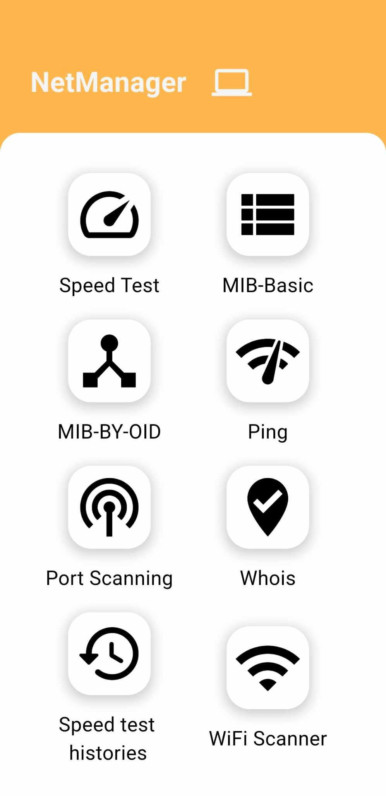

**Project Name: NetManager**

**Introduction:**

NetManager is a comprehensive Flutter application designed to provide essential network management functionalities right at your fingertips. Whether you need to perform a speed test, analyze network devices using MIB-Basic or MIB-BY-OID, troubleshoot connectivity with Ping and Port Scanning, or gather domain information with Whois lookup, NetManager has got you covered.

With a sleek and intuitive interface, NetManager offers a seamless user experience, allowing you to effortlessly navigate through its array of features. From monitoring your network's performance to diagnosing issues and maintaining optimal connectivity, NetManager empowers you to take control of your network management tasks with ease.

Explore the various tools and utilities offered by NetManager, including Speed Test Histories for tracking network performance over time. Please note that while NetManager is compatible with both iOS and Android platforms, the WiFi Scanner feature is exclusively available for Android users due to platform limitations.

Whether you're a seasoned network administrator or an everyday user looking to optimize your connectivity, NetManager is your go-to solution for efficient and reliable network management on the go.

Get started with NetManager today and elevate your network management experience to new heights.

